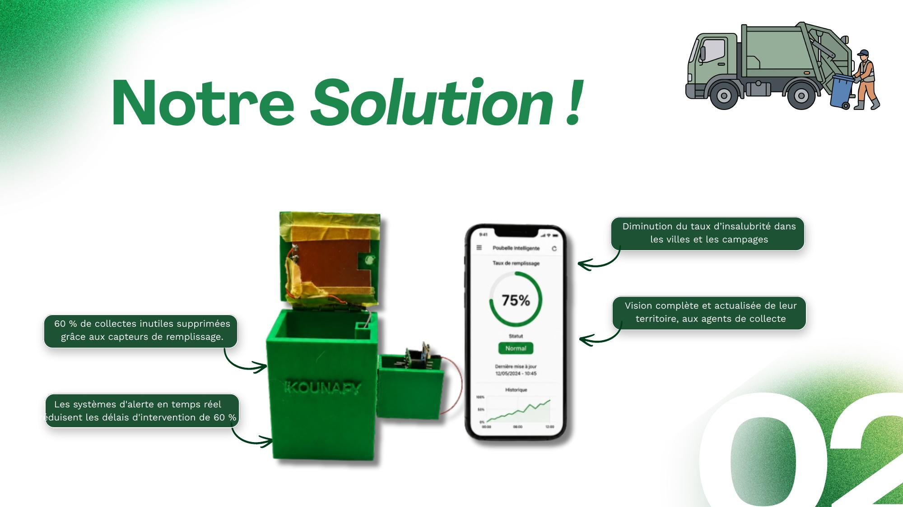
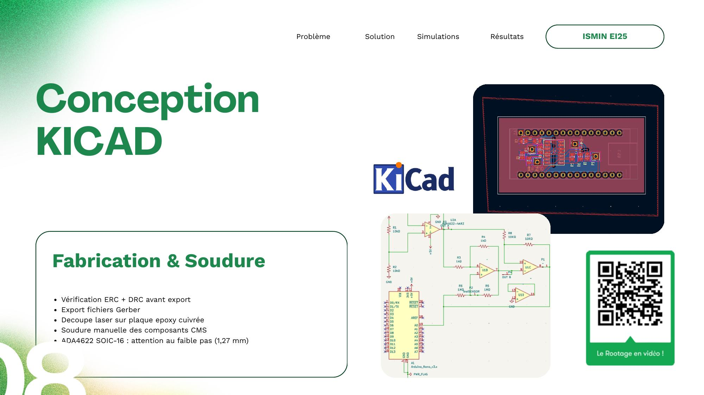
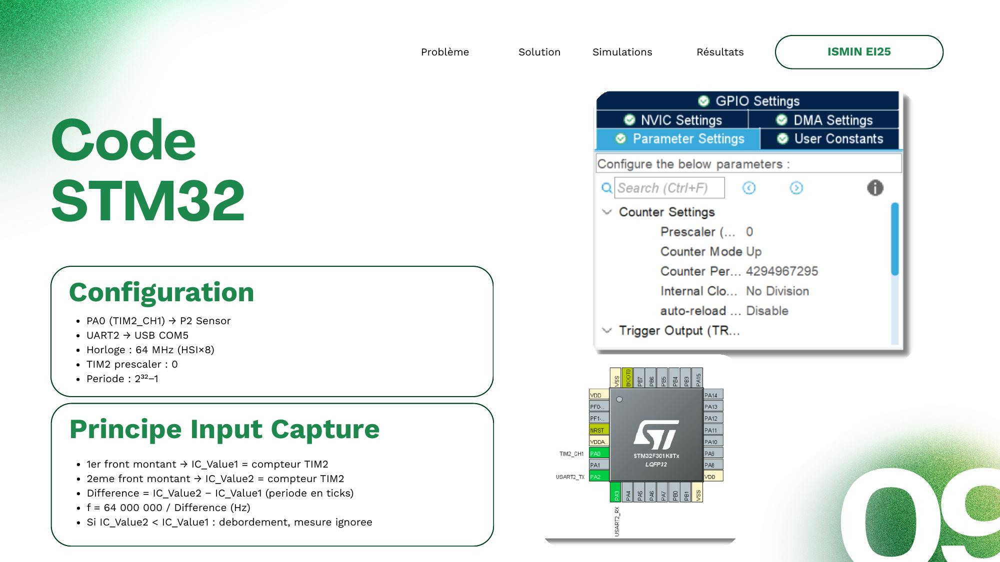
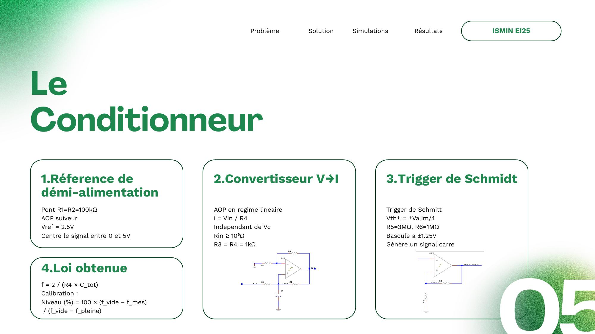
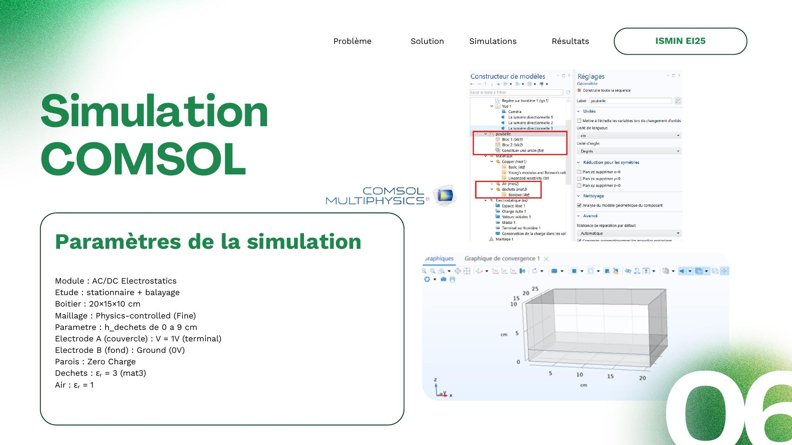
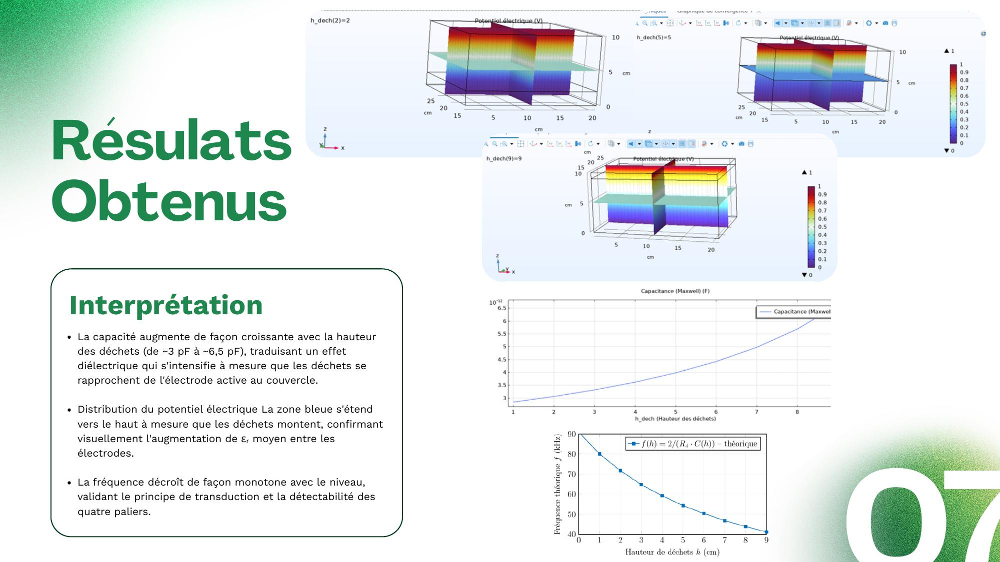
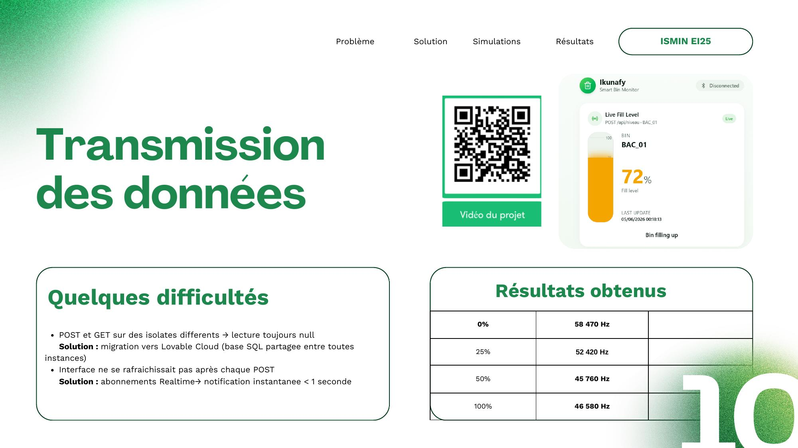
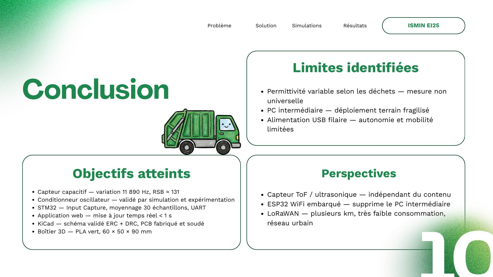

# SmartBin (Ikounafy) — Capacitive Fill-Level Sensing for Waste Bins

Embedded system that measures the fill level of a waste bin without contact,
using a capacitive sensor read by an STM32 microcontroller, and reports it
over UART to a live monitoring dashboard.

Built as part of an engineering prototyping project at ISMIN (École des Mines
de Saint-Étienne), with Mariem Boussarsar.

## Problem

- ~30% of waste bins are emptied while less than 50% full
- 40% of truck collection stops are made on bins that didn't need emptying
- Waste collection accounts for 60–80% of total waste management costs

Source: figures cited in project research (see `docs/` for full context).

## How it works

1. A relaxation-oscillator circuit uses the waste bin itself as one plate of
   a capacitor (lid electrode + base electrode). As the bin fills, the
   dielectric between the plates changes, which changes the capacitance —
   and therefore the oscillation frequency of the conditioning circuit.
2. The STM32 (STM32F301K8Tx) reads this frequency using **Timer 2 in Input
   Capture mode** (`PA0` / `TIM2_CH1`): it timestamps two consecutive rising
   edges and computes the frequency from the time difference.
3. The firmware averages 30 consecutive measurements to reduce noise, then
   maps the result to a 0–100% fill level using a linear interpolation
   between two calibrated reference points:
   - Empty bin: 65500 Hz
   - Full bin: 43900 Hz
4. The result is sent over UART (`PA2` / `USART2`, 38400 baud) as
   `NIVEAU:<value>\r\n` to a companion web dashboard (Lovable) for live
   monitoring.



## Hardware

- MCU: STM32F301K8Tx (STM32F3 series)
- Custom PCB (KiCad): relaxation oscillator (AOP ADA4622), Schmitt trigger,
  V→I converter — see `docs/` for schematics and PCB renders
- 3D-printed enclosure (PLA), 60×50×90 mm





## Repository structure

```
Core/               STM32 application code (main.c, interrupt handlers)
Drivers/            STM32 HAL / CMSIS (generated by STM32CubeMX)
Ikunafy.ioc          STM32CubeMX configuration (pin mapping, clocks, peripherals)
docs/               Schematics, PCB renders, simulation results, photos
```

## Validation

The sensor's physical model (parallel-plate capacitor with a variable
dielectric) was validated in two stages before the physical build:
- **COMSOL Multiphysics** electrostatic simulation across a 0–9 cm fill
  range, confirming a monotonic capacitance increase (~3 pF to ~6.5 pF)
  consistent with theory
- Physical calibration on the built prototype (see frequency thresholds
  above)






## Known limitations

- Calibration (dielectric permittivity) is specific to the waste
  composition tested; not universal across all waste types
- Requires a computer as an intermediate relay between the board and the
  dashboard in the current setup (no onboard Wi-Fi)
- Wired USB power limits mobility/autonomy

## Possible improvements

- ToF/ultrasonic sensor as a waste-composition-independent alternative
- Onboard ESP32 Wi-Fi to remove the computer relay
- LoRaWAN for long-range, low-power deployment



## Provenance note

The images in `docs/` are extracted from the project's final defense
presentation (June 2026), not from a dedicated photo shoot — resolution
and framing reflect that.

## Build

Open `Ikunafy.ioc` in STM32CubeIDE (or import the project directory
directly) and build/flash as usual.

## License

This project's own code (`Core/`) is released under the MIT License — see
`LICENSE`. The `Drivers/` folder contains STMicroelectronics' HAL and CMSIS
files, which remain under their original ST license (see the `LICENSE.txt`
files within that folder); the MIT license above does not apply to them.
